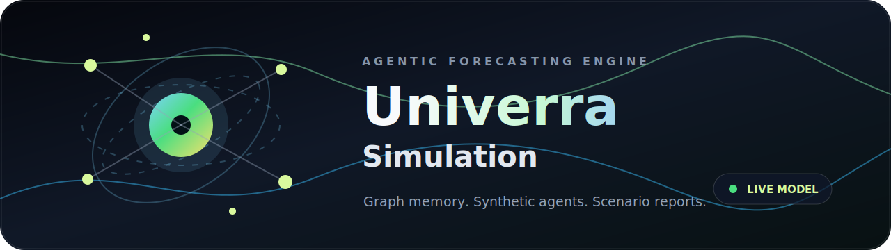
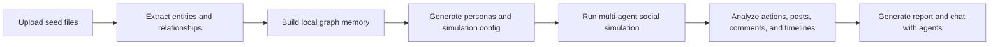
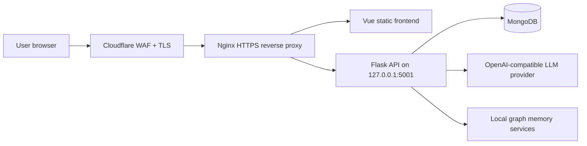

<div align="center">
  

  <h1>Univerra Simulation</h1>
  <p><strong>AI social simulation, local graph memory, and agentic forecasting for complex decisions.</strong></p>
  <p>Developed by <strong>Dheeraj Sharma</strong>, an Indian developer building decision-intelligence tools for real-world scenario testing.</p>

  <p>
    <a href="#one-click-local-start">One-click start</a> |
    <a href="#how-univerra-works">How it works</a> |
    <a href="#compute-requirements">Compute</a> |
    <a href="#production-deployment">Deploy</a> |
    <a href="#security">Security</a>
  </p>

  <p>
    
    
    
    
    
  </p>
</div>

## Overview

Univerra Simulation is a full-stack predictive simulation workspace for teams that need to test decisions before they meet the real world. Upload seed documents, describe a forecast question, generate a relationship graph, create agent personas, run social simulations, and produce analyst-grade reports from the resulting world state.

Repository name: `codexnexor/univerra-simulation`

SEO keywords: Univerra Simulation, AI prediction engine, multi-agent simulation, social media simulation, local graph memory, agent forecasting, policy simulation, market reaction forecasting, synthetic agents, public opinion analysis, decision intelligence, Dheeraj Sharma AI project, Indian developer AI simulation.

## What You Can Build

| Use case | What Univerra simulates | Output |
| --- | --- | --- |
| Product launch reaction | Audiences, personas, adoption barriers, objections | Risk map and launch report |
| Public policy testing | Stakeholders, social groups, narratives, opposition paths | Policy impact forecast |
| Market and brand scenarios | Sentiment shifts, influence paths, user clusters | Executive report and graph insights |
| Story or worldbuilding sandbox | Characters, motivations, relationships, evolving events | Interactive synthetic world |
| Research experiments | Configurable agents, rounds, actions, and memory | Reproducible simulation artifacts |

## How Univerra Works



| Stage | System component | What happens |
| --- | --- | --- |
| 1. Graph build | Flask API + graph builder | Parses uploaded PDF, Markdown, or text and creates structured entities. |
| 2. Context memory | Local graph services | Stores relationships and memory for downstream simulation reasoning without an external graph-memory vendor dependency. |
| 3. Persona generation | LLM orchestration | Expands entities into synthetic agents with goals, traits, and platform behavior. |
| 4. Simulation run | OASIS-backed runners | Executes Reddit/Twitter-style interactions across controlled rounds. |
| 5. Report agent | Tool-using report pipeline | Produces sections, evaluations, statistics, and interactive follow-up answers. |

## Interface

The frontend is a Vue 3 workspace with an animated first-screen experience, guided simulation steps, live progress views, graph exploration, report generation, user auth, and profile-aware history.

Key screens:

- Animated landing and authentication flow
- Project and upload workflow
- Ontology and graph generation
- Simulation preparation and run monitor
- Report workspace with streamed logs
- Agent interaction and history views

## What This Codebase Actually Does

| Layer | Important files | Responsibility |
| --- | --- | --- |
| Web app | `frontend/src/views`, `frontend/src/components` | Animated product entry, authenticated workspace, graph views, simulation steps, report pages, and profile history. |
| API gateway | `backend/app/api` | Flask routes for auth, graph generation, simulation lifecycle, report generation, downloads, and interaction APIs. |
| User system | `backend/app/services/user_store.py`, `auth_service.py` | Signup/login, signed auth tokens, profile context, MongoDB-backed user history. |
| Research tools | `tavily_research.py`, `reddit_research.py` | Optional web/social research enrichment for stronger report context. |
| Local graph memory | `graph_builder.py`, `local_graph_store.py`, `graph_tools.py` | Entity extraction, graph persistence, relationship lookup, graph context for agents and reports. |
| Persona expansion | `scenario_agent_expander.py`, `oasis_profile_generator.py` | Converts seed context into synthetic agents with traits, goals, platform behavior, and profiles. |
| Simulation engine | `simulation_runner.py`, `simulation_manager.py`, `backend/scripts` | Prepares and runs OASIS-style Reddit/Twitter simulations, state files, logs, actions, timelines, and DB artifacts. |
| Report agent | `report_agent.py` | Turns simulation output into structured reports, sections, stats, evaluations, and chat-style follow-up analysis. |
| Deployment | `DEPLOYMENT.md`, `docker-compose.yml`, `Dockerfile` | Ubuntu VPS, Nginx, HTTPS, Cloudflare, systemd backend, and Docker local testing. |

## Comparison

| Approach | What it gives you | What Univerra Simulation adds |
| --- | --- | --- |
| Prompt-only LLM chat | One answer from one model call | Multi-stage graph extraction, persona generation, simulation rounds, artifacts, and report synthesis. |
| Analytics dashboard | Charts over existing data | Synthetic future-state testing where agents react to proposed scenarios before real users do. |
| Notebook prototype | Flexible experiments for developers | A full web product with auth, uploads, progress views, reports, deployment docs, and repeatable workflows. |
| Generic agent framework | Building blocks for agents | Domain workflow for social prediction: local graph memory, simulated platforms, timelines, posts, comments, and report tools. |
| Legacy simulation baseline | Graph extraction plus agent simulation | Univerra Simulation adds product-grade UX, auth, profile-aware history, local graph memory, web/social research enrichment, report tooling, VPS deployment, Cloudflare hardening, and clean public branding. |
| Survey tool | Human-submitted responses | Fast synthetic exploration for early scenario testing before spending time and money on real surveys. |
| Prediction market | Aggregate belief from participants | Agent-level behavioral traces, social interactions, failure points, and narrative explanation. |

## Capability Benchmarks

These benchmarks describe the platform surface area and operating model. They are intended to help teams compare Univerra Simulation with a raw codebase, a notebook, or a single LLM prompt.

| Capability | Basic prototype | Univerra Simulation |
| --- | --- | --- |
| Scenario ingestion | Manual prompt writing | Upload files, extract entities, build structured graph context. |
| Memory layer | External service or no memory | Local graph store with nodes, edges, episodes, relationship search, and simulation activity updates. |
| Agent creation | Handwritten personas | Automated persona expansion from seed context, graph facts, and simulation goals. |
| Simulation trace | Ad hoc logs | Run state, actions, posts, comments, timelines, profiles, and downloadable artifacts. |
| Reporting | One-shot answer | Multi-section report agent with evidence bundle, statistics, logs, evaluations, and follow-up chat. |
| Product readiness | Developer-only scripts | Vue workspace, auth, profiles, history, deployment guide, HTTPS, Nginx, Cloudflare, and rate controls. |
| Governance | Anyone can push if they have access | Main branch is protected; changes must go through pull request review. |

## Compute Requirements

Simulation cost depends mostly on agent count, rounds, LLM provider latency, and report depth.

| Deployment size | Recommended machine | Good for | Notes |
| --- | --- | --- | --- |
| Local demo | 4 CPU cores, 8 GB RAM | Small files, short simulations | Start with 8-20 agents and low rounds. |
| Small VPS | 4 vCPU, 8-16 GB RAM | Private beta, light team usage | Keep backend behind Nginx and use rate limits. |
| Production VPS | 8+ vCPU, 16-32 GB RAM | Multiple users and longer simulations | Use systemd, Nginx, Cloudflare, MongoDB, and backups. |
| Heavy research | 16+ vCPU, 32+ GB RAM | Large persona sets and repeated runs | Queue jobs and monitor LLM spend carefully. |

LLM spend grows roughly with:

```text
seed complexity + generated agents + simulation rounds + report depth
```

## Benchmark Snapshot

These are lightweight repository validation checks, not claims about model accuracy. Run them again on your own VPS after changing code, dependencies, or hardware.

| Check | Command | Latest local result |
| --- | --- | --- |
| Frontend production build | `VITE_API_BASE_URL=/api npm run build` | Passed in 6.22s, `frontend/dist` is 660K. |
| Backend import/compile | `python3 -m compileall -q backend/app backend/scripts run.py` | Passed in 0.13s. |
| npm security audit | `npm audit && npm audit --prefix frontend` | 0 known vulnerabilities after dependency refresh. |
| API health route | `curl http://127.0.0.1:5001/health` | Returns `{"service":"Univerra Backend","status":"ok"}` when backend is running. |
| Deployment TLS | `curl -I https://simulation.univerra.sbs` | Returns an HTTPS response after Nginx and Certbot are configured. |

## One-click Local Start

Prerequisites:

| Tool | Version |
| --- | --- |
| Python | 3.11 or 3.12 |
| Node.js | 18+ |
| npm | Bundled with Node.js |

Start everything from the repository root:

```bash
cp .env.example .env
nano .env
python3 run.py
```

`run.py` installs frontend dependencies, installs backend dependencies with `uv`, creates missing local environment defaults, then starts both services.

Local URLs:

```text
Frontend: http://localhost:3000
Backend:  http://localhost:5001
```

## Manual Development Setup

```bash
cp .env.example .env
npm run setup:all
npm run dev
```

Run services separately:

```bash
npm run backend
npm run frontend
```

Build the frontend for production:

```bash
VITE_API_BASE_URL=/api npm run build
```

## Environment Variables

Minimum required configuration:

```env
LLM_API_KEY=changeme
LLM_BASE_URL=https://api.openai.com/v1
LLM_MODEL_NAME=gpt-5.4
FLASK_DEBUG=False
FLASK_HOST=127.0.0.1
FLASK_PORT=5001
AUTH_SECRET_KEY=changeme
MONGODB_URI=changeme
MONGODB_DB_NAME=univerra
```

Recommended production limits:

```env
UNIVERRA_LLM_RPM=30
UNIVERRA_SIM_SEMAPHORE=1
UNIVERRA_MAX_ACTIVE_AGENTS=2
RATE_LIMIT_AUTH_ATTEMPTS=5
RATE_LIMIT_AUTH_WINDOW_SECONDS=900
```

Never commit `.env`. Only commit `.env.example` with placeholder values.

## Production Deployment

For Ubuntu VPS deployment with Nginx, HTTPS, Certbot, Cloudflare Full strict SSL, origin hardening, real visitor IPs, and systemd backend hosting, use:

[DEPLOYMENT.md](./DEPLOYMENT.md)

Current target domain from the included guide:

```text
https://simulation.univerra.sbs
```

Production architecture:



## Docker

For local Docker testing:

```bash
cp .env.example .env
docker compose up --build
```

For production, prefer the Nginx + systemd deployment in `DEPLOYMENT.md` so the backend stays private and the frontend is served as static files.

## Security

Before publishing or deploying:

- Keep `.env`, uploads, logs, virtual environments, and `node_modules` out of Git.
- Use `FLASK_DEBUG=False` on servers.
- Bind the backend to `127.0.0.1`.
- Put Nginx in front of the API.
- Use HTTPS with Certbot or Cloudflare Origin CA.
- Use Cloudflare Full strict SSL, WAF, rate rules, and origin protection.
- Rotate any API key that was ever pasted into a shared channel.
- Back up MongoDB and `backend/uploads` separately.
- Review staged files before every push:

```bash
git status --short
git diff --cached --name-only
```

## Repository Governance

The public repository is configured so `main` is the production branch. All future code changes should arrive through a pull request, where Dheeraj Sharma reviews the diff before merge.

| Control | Purpose |
| --- | --- |
| `CODEOWNERS` | Marks `@CodexNexor` as owner for every file in the repository. |
| Protected `main` | Blocks direct pushes and force pushes after branch protection is enabled. |
| Pull request review | Creates a visible approval trail before code reaches production. |
| Conversation resolution | Keeps unresolved review comments from being ignored. |

## Repository Hygiene

Ignored by default:

| Path | Reason |
| --- | --- |
| `.env` | Secrets and deployment credentials |
| `backend/uploads/` | User files, reports, generated simulations |
| `backend/logs/` | Runtime logs |
| `node_modules/` | Installed packages |
| `frontend/dist/` | Generated build output |
| `backend/.venv/`, `venv/` | Local Python environments |

## License

AGPL-3.0. See [LICENSE](./LICENSE).

## Acknowledgments

Univerra uses open-source foundations including Vue, Flask, OpenAI-compatible APIs, MongoDB tooling, and OASIS-style social simulation components.
